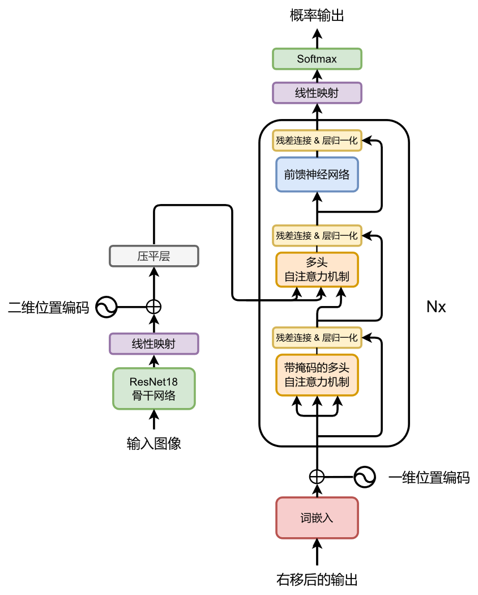
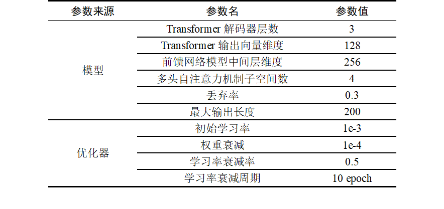
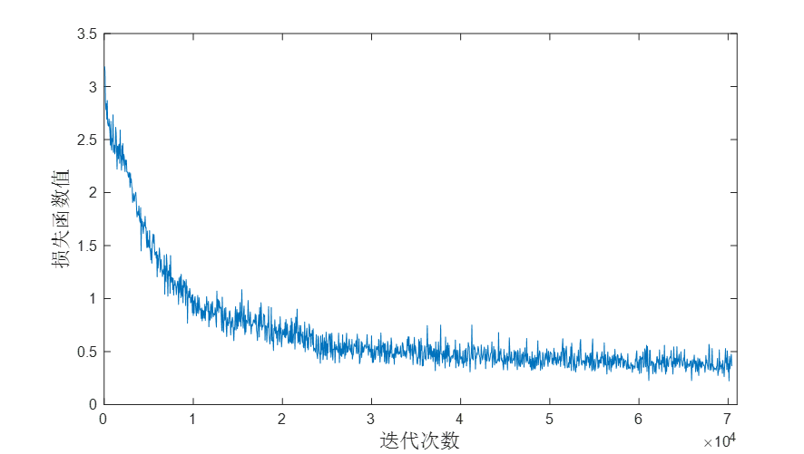
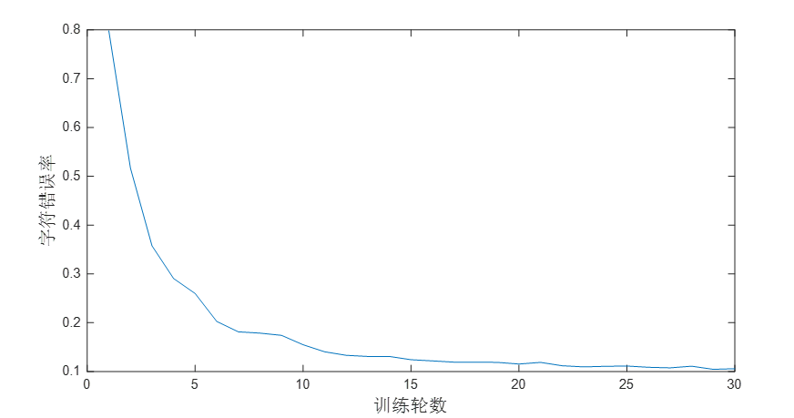
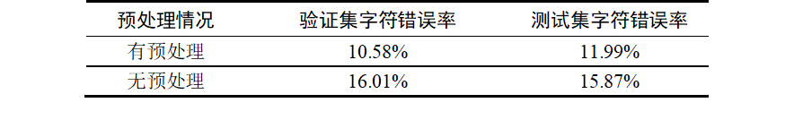

# 基于Resnet-Transformer的手写数学表示式识别

**本项目仅为课程大作业，并非正式发表的科研论文，实验过程可能存在漏洞，欢迎大家通过issue或PR向我反馈。**

## 任务概述

本项目涉及的任务是手写数学表达式识别（Handwritten Mathematical Expression Recognition，HMER）。手写数学表达式识别任务的目标是对于输入的只包含手写数学表达式的图片，通过算法分析，将图片转成对应的Latex数学表达式，它属于光学字符识别（Optical Character Recognition, OCR）的一个分支，但因为其具有局部歧义性、结构复杂性等特点，难以使用常规的基于定位、拆分、识别的光学字符识别方法进行处理。

## 网络结构

## 网络参数

按下表所示的参数构建模型，使用AdamW优化器进行优化，使用MultiStepLR的动态学习率调整策略。

## 评价指标

本实验采用字符错误率（Character Error Rate，CER）作为评价指标，每当在表达式中发生替换、删除和增加时，都记作一次错误。

$$
CER=\frac{N_{sub} +N_{del} +N_{ins} }{N}=\frac{N_{sub}+N_{del}+N_{ins} }{N_{sub} +N_{del} +N_{cor} }
$$

## 实验环境

运行实验的硬件环境包括Intel(R) Xeon(R) CPU E5-2680 v4 @ 2.40GHz CPU、16GB内存和NVIDIA TITAN Xp显卡，软件环境包括Ubuntu 20.04操作系统、CUDA 11.3、Python 3.8、PyTorch 1.11.0等。

## 预处理

图像预处理的主要目的是消除图像中无关的信息、恢复有用的真实信息、增强有关信息的可检测性和最大限度地简化数据。本实验对图片的预处理分为以下几个步骤：

（1） 图片灰度化。

（2） 裁剪公式部分。通过检测像素灰度值，找到公式的边界，从而将公式裁剪出来。

（3） 填充。对裁剪出来的公式上下左右各填充8个白像素。

**百度网盘中提供的数据集为已经完成预处理的数据集。**

## 训练过程与结果

设置batch size为32，在上述实验环境下训练30轮，共70410步。得到如下图所示的训练集损失函数值曲线和验证集字符错误率曲线。

下表展示了模型在验证集和测试集上的表现

